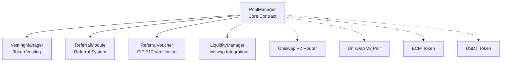

# Complete Deployment & Setup Guide for ECM Liquidity Mining Pool

## Overview

This guide provides step-by-step instructions to deploy and configure the complete ECM Liquidity Mining Pool ecosystem. The system consists of five main contracts that work together to provide token sales, staking, rewards, referrals, and liquidity management.

## Architecture Overview



## Prerequisites

### System Requirements
- Node.js 18.0.0 or higher
- npm or pnpm package manager
- Git
- Sufficient ETH for gas fees (mainnet/testnet deployment)

### Network Requirements
- RPC endpoint for target network
- Private key with sufficient funds
- Etherscan API key (for verification)

### Token Requirements
- ECM token contract address (or deploy new)
- USDT token contract address (or use existing)
- Uniswap V2 pair (ECM/USDT) - will be created if doesn't exist

## Step 1: Environment Setup

### 1.1 Clone and Install Dependencies

```bash
git clone <repository-url>
cd liquidity-mining-pool
npm install
# or
pnpm install
```

### 1.2 Configure Environment Variables

Create `.env` file in project root:

```bash
# Required for deployment
ETHERSCAN_API_KEY=your_etherscan_api_key
PRIVATE_KEY=your_private_key_without_0x_prefix

# Network URLs
MAINNET_RPC_URL=https://eth-mainnet.g.alchemy.com/v2/your_api_key
SEPOLIA_RPC_URL=https://ethereum-sepolia-rpc.publicnode.com
BSC_TESTNET_URL=https://bsc-testnet.publicnode.com

# Optional: Custom network configurations
POLYGON_RPC_URL=https://polygon-mainnet.g.alchemy.com/v2/your_api_key
ARBITRUM_RPC_URL=https://arb-mainnet.g.alchemy.com/v2/your_api_key
```

### 1.3 Compile Contracts

```bash
npm run build
# or
pnpm build
```

### 1.4 Run Tests (Optional but Recommended)

```bash
npm run test
# or for detailed logs
npm run test:logs
```

## Step 2: Network-Specific Deployment Prerequisites

### 2.1 Ethereum Mainnet
- **Uniswap V2 Router**: `0x7a250d5630B4cF539739dF2C5dAcb4c659F2488D`
- **Gas Price**: ~30-50 gwei (check current network conditions)
- **Required ETH**: ~0.2-0.5 ETH for full deployment

### 2.2 Ethereum Sepolia Testnet
- **Uniswap V2 Router**: `0x7a250d5630B4cF539739dF2C5dAcb4c659F2488D` (if available)
- **Test ETH**: Get from [Sepolia faucet](https://sepoliafaucet.com/)
- **Gas Price**: ~1-2 gwei

### 2.3 BSC Mainnet
- **PancakeSwap Router**: `0x10ED43C718714eb63d5aA57B78B54704E256024E`
- **Required BNB**: ~0.1-0.2 BNB

### 2.4 Polygon Mainnet
- **QuickSwap Router**: `0xa5E0829CaCEd8fFDD4De3c43696c57F7D7A678ff`
- **Required MATIC**: ~50-100 MATIC

## Step 3: Contract Deployment Order

**❗ CRITICAL: Contracts must be deployed in this exact order due to dependencies**

### Phase 1: Independent Contracts

#### 3.1 Deploy ReferralVoucher Contract

```bash
# Deploy ReferralVoucher (no dependencies)
npx hardhat ignition deploy ignition/modules/referral-voucher.ts --network sepolia

# Or manually via console:
npx hardhat console --network sepolia
```

```javascript
// In Hardhat console
const ReferralVoucher = await ethers.getContractFactory("ReferralVoucher");
const referralVoucher = await ReferralVoucher.deploy();
await referralVoucher.waitForDeployment();
console.log("ReferralVoucher deployed to:", referralVoucher.target);
```

**Save the address**: `REFERRAL_VOUCHER_ADDRESS`

#### 3.2 Deploy ReferralModule Contract

```javascript
// In Hardhat console
const ReferralModule = await ethers.getContractFactory("ReferralModule");
const referralModule = await ReferralModule.deploy();
await referralModule.waitForDeployment();
console.log("ReferralModule deployed to:", referralModule.target);
```

**Save the address**: `REFERRAL_MODULE_ADDRESS`

### Phase 2: Core Contracts

#### 3.3 Deploy PoolManager Contract

```javascript
// Replace with actual Uniswap V2 Router address for your network
const UNISWAP_ROUTER = "0x7a250d5630B4cF539739dF2C5dAcb4c659F2488D"; // Ethereum

const PoolManager = await ethers.getContractFactory("PoolManager");
const poolManager = await PoolManager.deploy(UNISWAP_ROUTER);
await poolManager.waitForDeployment();
console.log("PoolManager deployed to:", poolManager.target);
```

**Save the address**: `POOL_MANAGER_ADDRESS`

#### 3.4 Deploy VestingManager Contract

```javascript
const VestingManager = await ethers.getContractFactory("VestingManager");
const vestingManager = await VestingManager.deploy(poolManager.target);
await vestingManager.waitForDeployment();
console.log("VestingManager deployed to:", vestingManager.target);
```

**Save the address**: `VESTING_MANAGER_ADDRESS`

#### 3.5 Deploy LiquidityManager Contract

```javascript
// Replace with your treasury/multisig address
const TREASURY_ADDRESS = "0x..."; // Your treasury address

const LiquidityManager = await ethers.getContractFactory("LiquidityManager");
const liquidityManager = await LiquidityManager.deploy(
    UNISWAP_ROUTER,
    TREASURY_ADDRESS
);
await liquidityManager.waitForDeployment();
console.log("LiquidityManager deployed to:", liquidityManager.target);
```

**Save the address**: `LIQUIDITY_MANAGER_ADDRESS`

## Step 4: Contract Configuration

### Phase 3: Wire Contract Dependencies

#### 4.1 Configure PoolManager

```javascript
// Set VestingManager
await poolManager.setVestingManager(vestingManager.target);
console.log("✅ VestingManager set in PoolManager");

// Set ReferralVoucher
await poolManager.setReferralVoucher(referralVoucher.target);
console.log("✅ ReferralVoucher set in PoolManager");

// Set ReferralModule
await poolManager.setReferralModule(referralModule.target);
console.log("✅ ReferralModule set in PoolManager");

// Authorize LiquidityManager
await poolManager.addAuthorizedLiquidityManager(liquidityManager.target);
console.log("✅ LiquidityManager authorized in PoolManager");
```

#### 4.2 Configure VestingManager

```javascript
// Authorize PoolManager as creator
await vestingManager.addAuthorizedCreator(poolManager.target);
console.log("✅ PoolManager authorized in VestingManager");
```

#### 4.3 Configure ReferralModule

```javascript
// Set PoolManager
await referralModule.setPoolManager(poolManager.target);
console.log("✅ PoolManager set in ReferralModule");

// Set ReferralVoucher
await referralModule.setReferralVoucher(referralVoucher.target);
console.log("✅ ReferralVoucher set in ReferralModule");
```

#### 4.4 Configure ReferralVoucher

```javascript
// Set PoolManager
await referralVoucher.setPoolManager(poolManager.target);
console.log("✅ PoolManager set in ReferralVoucher");

// Set ReferralModule
await referralVoucher.setReferralModule(referralModule.target);
console.log("✅ ReferralModule set in ReferralVoucher");

// Add issuer (your backend address that will sign vouchers)
const ISSUER_ADDRESS = "0x..."; // Your backend signing address
await referralVoucher.addIssuer(ISSUER_ADDRESS);
console.log("✅ Issuer added to ReferralVoucher");
```

#### 4.5 Configure LiquidityManager

```javascript
// Set PoolManager for tracking callbacks
await liquidityManager.setPoolManager(poolManager.target);
console.log("✅ PoolManager set in LiquidityManager");
```

## Step 5: Token Setup

### 5.1 Existing Tokens (Mainnet)

If using existing tokens on mainnet:

```javascript
// Connect to existing tokens
const ECM_TOKEN_ADDRESS = "0x..."; // Your ECM token address
const USDT_TOKEN_ADDRESS = "0xdAC17F958D2ee523a2206206994597C13D831ec7"; // USDT on Ethereum

const ecmToken = await ethers.getContractAt("IERC20", ECM_TOKEN_ADDRESS);
const usdtToken = await ethers.getContractAt("IERC20", USDT_TOKEN_ADDRESS);
```

### 5.2 Deploy Mock Tokens (Testnet)

For testing on testnets:

```javascript
// Deploy Mock ECM Token
const MockERC20 = await ethers.getContractFactory("MockERC20");
const ecmToken = await MockERC20.deploy(
    "ECM Token",
    "ECM",
    18,
    ethers.parseEther("10000000") // 10M ECM
);
await ecmToken.waitForDeployment();
console.log("Mock ECM deployed to:", ecmToken.target);

// Deploy Mock USDT Token
const usdtToken = await MockERC20.deploy(
    "Tether USD",
    "USDT", 
    6,
    ethers.parseUnits("10000000", 6) // 10M USDT
);
await usdtToken.waitForDeployment();
console.log("Mock USDT deployed to:", usdtToken.target);
```

### 5.3 Create or Connect Uniswap Pair

#### For Mainnet (if pair exists):
```javascript
const UNISWAP_FACTORY = "0x5C69bEe701ef814a2B6a3EDD4B1652CB9cc5aA6f";
const factory = await ethers.getContractAt("IUniswapV2Factory", UNISWAP_FACTORY);
const pairAddress = await factory.getPair(ecmToken.target, usdtToken.target);

if (pairAddress === ethers.ZeroAddress) {
    console.log("❌ Pair doesn't exist, need to create it");
} else {
    console.log("✅ Pair exists at:", pairAddress);
}
```

#### For Testnet (deploy mock pair):
```javascript
const MockUniswapV2Pair = await ethers.getContractFactory("MockUniswapV2Pair");
const uniswapPair = await MockUniswapV2Pair.deploy(
    ecmToken.target,
    usdtToken.target
);
await uniswapPair.waitForDeployment();
console.log("Mock Pair deployed to:", uniswapPair.target);

// Add initial liquidity to mock pair
const INITIAL_ECM = ethers.parseEther("100000"); // 100K ECM
const INITIAL_USDT = ethers.parseUnits("50000", 6); // 50K USDT

await ecmToken.transfer(uniswapPair.target, INITIAL_ECM);
await usdtToken.transfer(uniswapPair.target, INITIAL_USDT);
await uniswapPair.sync();
console.log("✅ Initial liquidity added to mock pair");
```

## Step 6: Pool Creation and Configuration

### 6.1 Create First Pool

```javascript
// Pool parameters
const poolParams = {
    ecm: ecmToken.target,
    usdt: usdtToken.target,
    pair: uniswapPair.target, // From step 5.3
    penaltyReceiver: TREASURY_ADDRESS, // Where slashed tokens go
    rewardStrategy: 0, // 0 = LINEAR, 1 = MONTHLY, 2 = WEEKLY
    allowedStakeDurations: [
        30 * 24 * 3600,   // 30 days
        90 * 24 * 3600,   // 90 days  
        180 * 24 * 3600   // 180 days - users choose from these options
    ],
    maxDuration: 180 * 24 * 3600, // 180 days maximum
    vestingDuration: 180 * 24 * 3600, // 180 days vesting
    vestRewardsByDefault: false, // Don't vest by default
    penaltyBps: 2500 // 25% penalty for early unstaking (configurable, default business requirement)
};

const tx = await poolManager.createPool(poolParams);
const receipt = await tx.wait();
console.log("✅ Pool created. Pool ID: 0");

const poolId = 0; // First pool
```

### 6.2 Allocate Tokens to Pool

```javascript
// Allocate ECM for sale (tokens users can buy)
const SALE_ALLOCATION = ethers.parseEther("1000000"); // 1M ECM
await ecmToken.approve(poolManager.target, SALE_ALLOCATION);
await poolManager.allocateForSale(poolId, SALE_ALLOCATION);
console.log("✅ ECM allocated for sale:", ethers.formatEther(SALE_ALLOCATION));

// Allocate ECM for rewards (tokens paid as staking rewards)
const REWARD_ALLOCATION = ethers.parseEther("500000"); // 500K ECM
await ecmToken.approve(poolManager.target, REWARD_ALLOCATION);
await poolManager.allocateForRewards(poolId, REWARD_ALLOCATION);
console.log("✅ ECM allocated for rewards:", ethers.formatEther(REWARD_ALLOCATION));
```

### 6.3 Configure Reward Strategy

#### For LINEAR Strategy:
```javascript
// Configure LINEAR reward rate (auto-calculated based on allocation and maxDuration)
await poolManager.setLinearRewardRate(poolId);
console.log("✅ Linear reward rate configured");

const poolInfo = await poolManager.getPoolInfo(poolId);
console.log("Reward rate per second:", ethers.formatEther(poolInfo.rewardRatePerSecond));
```

#### For MONTHLY Strategy:
```javascript
// Configure MONTHLY rewards (6 months example)
const monthlyRewards = [
    ethers.parseEther("50000"),  // Month 1: 50K ECM
    ethers.parseEther("60000"),  // Month 2: 60K ECM
    ethers.parseEther("70000"),  // Month 3: 70K ECM
    ethers.parseEther("80000"),  // Month 4: 80K ECM
    ethers.parseEther("90000"),  // Month 5: 90K ECM
    ethers.parseEther("100000"), // Month 6: 100K ECM
];

await poolManager.setMonthlyRewards(poolId, monthlyRewards);
console.log("✅ Monthly rewards configured");
```

#### For WEEKLY Strategy:
```javascript
// Configure WEEKLY rewards (12 weeks example)
const weeklyRewards = Array(12).fill(ethers.parseEther("10000")); // 10K ECM per week

await poolManager.setWeeklyRewards(poolId, weeklyRewards);
console.log("✅ Weekly rewards configured");
```

### 6.4 Activate Pool

```javascript
await poolManager.setPoolActive(poolId, true);
console.log("✅ Pool activated");
```

## Step 7: Referral System Configuration

### 7.1 Configure Multi-Level Commission Rates

```javascript
// Set pool-level multi-level commission configuration
// [Level 1, Level 2, Level 3] in basis points (100 bps = 1%)
const levelConfig = [
    500,  // Level 1: 5%
    300,  // Level 2: 3%
    200   // Level 3: 2%
];

await referralModule.setPoolLevelConfig(poolId, levelConfig);
console.log("✅ Multi-level commission rates configured");
```

### 7.2 Fund Referral Module for Direct Commissions

```javascript
// Transfer ECM to ReferralModule for immediate commission payments
const COMMISSION_FUND = ethers.parseEther("50000"); // 50K ECM
await ecmToken.approve(referralModule.target, COMMISSION_FUND);
await referralModule.fundContract(ecmToken.target, COMMISSION_FUND);
console.log("✅ ReferralModule funded for direct commissions");
```

## Step 8: Liquidity Management Setup

### 8.1 Transfer Tokens to LiquidityManager

```javascript
// Transfer some collected USDT and ECM to LiquidityManager for adding liquidity
// (This would typically be done after users start buying/staking)

// Example: Transfer tokens for initial liquidity
const ecmForLiquidity = ethers.parseEther("10000"); // 10K ECM
const usdtForLiquidity = ethers.parseUnits("5000", 6); // 5K USDT

await poolManager.transferToLiquidityManager(
    poolId,
    liquidityManager.target,
    ecmForLiquidity,
    usdtForLiquidity
);
console.log("✅ Tokens transferred to LiquidityManager");
```

### 8.2 Add Liquidity to Uniswap

```javascript
// Add liquidity to Uniswap V2 (owner of LiquidityManager)
const liquidityParams = {
    tokenA: ecmToken.target,
    tokenB: usdtToken.target,
    amountADesired: ecmForLiquidity,
    amountBDesired: usdtForLiquidity,
    amountAMin: ecmForLiquidity * 95n / 100n, // 5% slippage
    amountBMin: usdtForLiquidity * 95n / 100n, // 5% slippage
    to: TREASURY_ADDRESS, // LP tokens go to treasury
    deadline: Math.floor(Date.now() / 1000) + 1800 // 30 minutes
};

await liquidityManager.addLiquidityWithTracking(
    liquidityParams,
    poolId,
    ecmToken.target
);
console.log("✅ Liquidity added to Uniswap with tracking");
```

## Step 9: Contract Verification

### 9.1 Verify on Etherscan

```bash
# Verify all contracts
npx hardhat verify --network sepolia REFERRAL_VOUCHER_ADDRESS
npx hardhat verify --network sepolia REFERRAL_MODULE_ADDRESS  
npx hardhat verify --network sepolia POOL_MANAGER_ADDRESS "UNISWAP_ROUTER_ADDRESS"
npx hardhat verify --network sepolia VESTING_MANAGER_ADDRESS "POOL_MANAGER_ADDRESS"
npx hardhat verify --network sepolia LIQUIDITY_MANAGER_ADDRESS "UNISWAP_ROUTER_ADDRESS" "TREASURY_ADDRESS"

# Verify mock tokens (if deployed)
npx hardhat verify --network sepolia ECM_TOKEN_ADDRESS "ECM Token" "ECM" 18 "10000000000000000000000000"
npx hardhat verify --network sepolia USDT_TOKEN_ADDRESS "Tether USD" "USDT" 6 "10000000000000"
```

## Step 10: Operational Setup

### 10.1 Security Recommendations

```javascript
// Transfer ownership to multisig wallet
const MULTISIG_ADDRESS = "0x..."; // Your multisig address

await poolManager.transferOwnership(MULTISIG_ADDRESS);
await referralModule.transferOwnership(MULTISIG_ADDRESS);
await referralVoucher.transferOwnership(MULTISIG_ADDRESS);
await vestingManager.transferOwnership(MULTISIG_ADDRESS);
await liquidityManager.transferOwnership(MULTISIG_ADDRESS);

console.log("✅ Ownership transferred to multisig");
```

### 10.2 Monitoring Setup

Set up monitoring for:
- Contract balances
- Pool metrics (totalStaked, rewards distributed)
- Gas usage
- Transaction failures
- Emergency pause triggers

### 10.3 Backend Integration

Your backend needs to:
1. **Generate EIP-712 vouchers** for referral codes
2. **Monitor events** for off-chain reward calculations
3. **Submit Merkle roots** for multi-level reward distributions
4. **Handle user verification** for referral vouchers

## Step 11: Testing User Flows

### 11.1 Test Buy and Stake Flow

```javascript
// Simulate user buying and staking
const userAddress = "0x..."; // Test user address
const stakeAmount = ethers.parseEther("1000"); // 1000 ECM

// Calculate required USDT
const requiredUsdt = await poolManager.getRequiredUSDTForExactECM(poolId, stakeAmount);
console.log("Required USDT:", ethers.formatUnits(requiredUsdt, 6));

// User would approve USDT and select from allowed durations when calling buyExactECMAndStake
const selectedDuration = 90 * 24 * 3600; // 90 days (user choice from allowed durations)
// await poolManager.connect(user).buyExactECMAndStake(poolId, stakeAmount, requiredUsdt, selectedDuration, emptyVoucher, "0x");
```

### 11.2 Test Reward Claims

```javascript
// After some time, test reward claims
// await poolManager.connect(user).claimRewards(poolId);
```

### 11.3 Test Unstaking

```javascript
// Test unstaking (with or without penalty)
// await poolManager.connect(user).unstake(poolId);
```

## Step 12: Deployment Checklist

### Pre-Deployment
- [ ] Environment variables configured
- [ ] Network parameters verified
- [ ] Token addresses confirmed
- [ ] Uniswap router/pair addresses verified
- [ ] Treasury/multisig addresses set

### Deployment
- [ ] ReferralVoucher deployed and verified
- [ ] ReferralModule deployed and verified
- [ ] PoolManager deployed and verified
- [ ] VestingManager deployed and verified
- [ ] LiquidityManager deployed and verified
- [ ] All contract dependencies wired correctly

### Configuration
- [ ] Pool created with correct parameters
- [ ] ECM allocated for sale and rewards
- [ ] Reward strategy configured
- [ ] Pool activated
- [ ] Referral commission rates set
- [ ] Multi-level commission configured
- [ ] Issuer added to ReferralVoucher

### Security
- [ ] All contracts verified on Etherscan
- [ ] Ownership transferred to multisig
- [ ] Emergency pause mechanisms tested
- [ ] Access controls verified

### Operations
- [ ] Monitoring systems deployed
- [ ] Backend integration completed
- [ ] User flows tested
- [ ] Documentation updated

## Network-Specific Deployment Scripts

### Ethereum Mainnet
```bash
npx hardhat run scripts/deploy-mainnet.js --network mainnet
```

### Sepolia Testnet
```bash
npx hardhat run scripts/deploy-sepolia.js --network sepolia
```

### BSC Mainnet
```bash
npx hardhat run scripts/deploy-bsc.js --network bsc
```

### Custom Network
Add to `hardhat.config.ts`:
```typescript
customNetwork: {
  url: "YOUR_RPC_URL",
  accounts: [process.env.PRIVATE_KEY],
  verify: {
    etherscan: {
      apiKey: process.env.CUSTOM_API_KEY,
    },
  },
}
```

## Troubleshooting

### Common Issues

1. **"InsufficientLiquidity" Error**
   - Ensure Uniswap pair has sufficient liquidity
   - Check token balances in pair

2. **"NotAuthorized" Errors**
   - Verify all contract dependencies are wired correctly
   - Check ownership and authorization settings

3. **"SlippageExceeded" Errors**
   - Increase slippage tolerance
   - Check Uniswap pair reserves

4. **Gas Estimation Failures**
   - Ensure sufficient gas limits
   - Check network congestion

5. **Verification Failures**
   - Verify constructor arguments match exactly
   - Check compiler version and optimization settings

### Emergency Procedures

1. **Pause System**
   ```javascript
   await poolManager.pause();
   ```

2. **Emergency Token Recovery**
   ```javascript
   await poolManager.emergencyRecoverTokens(tokenAddress, amount, recipient);
   ```

3. **Revoke Malicious Referral Vouchers**
   ```javascript
   await referralVoucher.revokeVoucher(voucherId);
   ```

## Support and Resources

- **Documentation**: `/docs` folder
- **Test Files**: `/test` folder
- **Example Scripts**: `/scripts` folder
- **Configuration**: `hardhat.config.ts`

For technical support, refer to the comprehensive test suite in `/test/pool-manager.ts` which demonstrates all functionality and edge cases.

---

## Quick Deployment Summary

For experienced developers, here's the condensed deployment sequence:

```bash
# 1. Setup
npm install && npm run build

# 2. Deploy core contracts
ReferralVoucher -> ReferralModule -> PoolManager -> VestingManager -> LiquidityManager

# 3. Wire dependencies
PoolManager.setVestingManager(vestingManager)
PoolManager.setReferralModule(referralModule)  
PoolManager.setReferralVoucher(referralVoucher)
VestingManager.addAuthorizedCreator(poolManager)
ReferralModule.setPoolManager(poolManager)
ReferralVoucher.setPoolManager(poolManager)
LiquidityManager.setPoolManager(poolManager)

# 4. Create and configure pool
poolManager.createPool(params)
poolManager.allocateForSale(poolId, amount)
poolManager.allocateForRewards(poolId, amount) 
poolManager.setLinearRewardRate(poolId)
poolManager.setPoolActive(poolId, true)

# 5. Security
Transfer ownership to multisig
```

This completes the full deployment and setup process for the ECM Liquidity Mining Pool ecosystem.